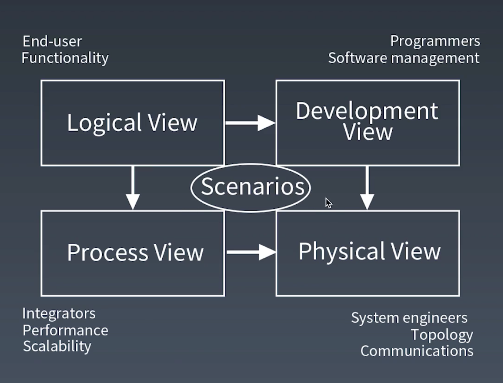
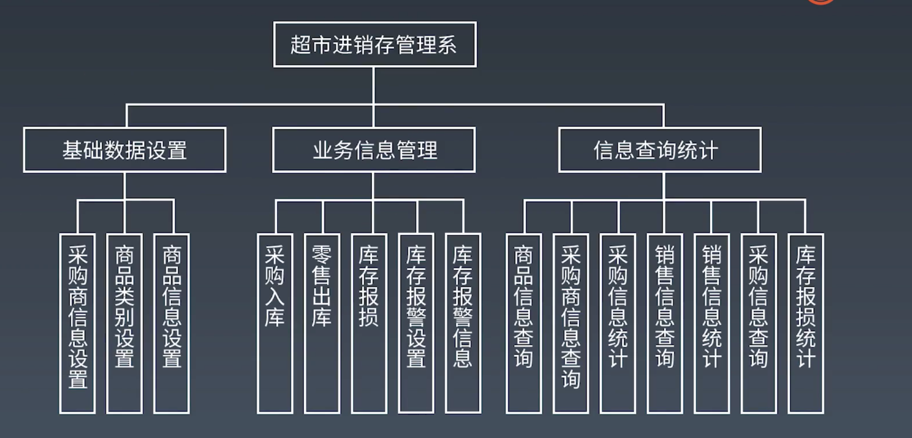
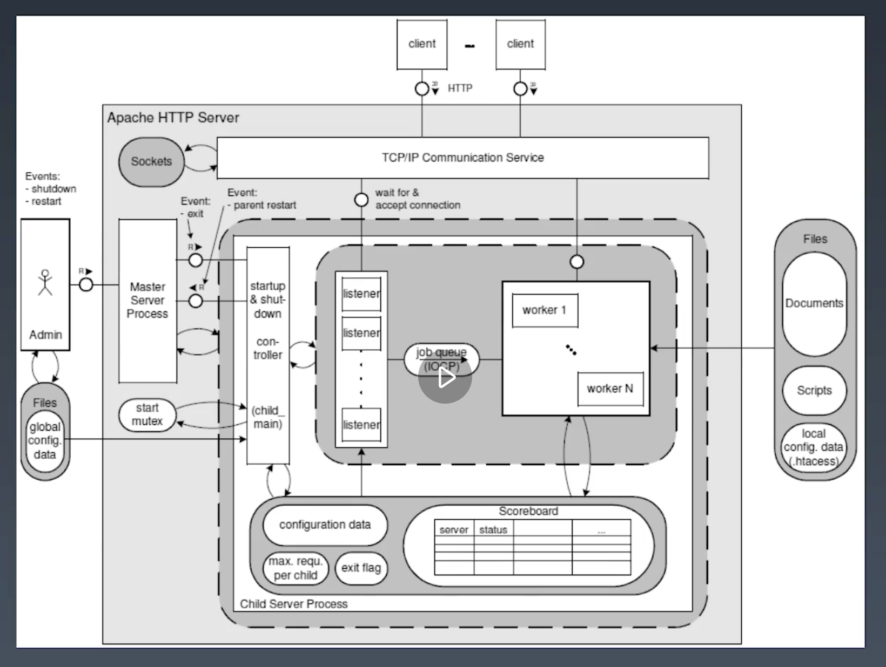
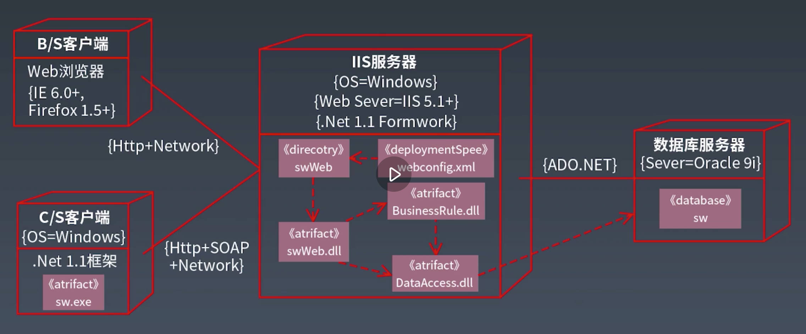
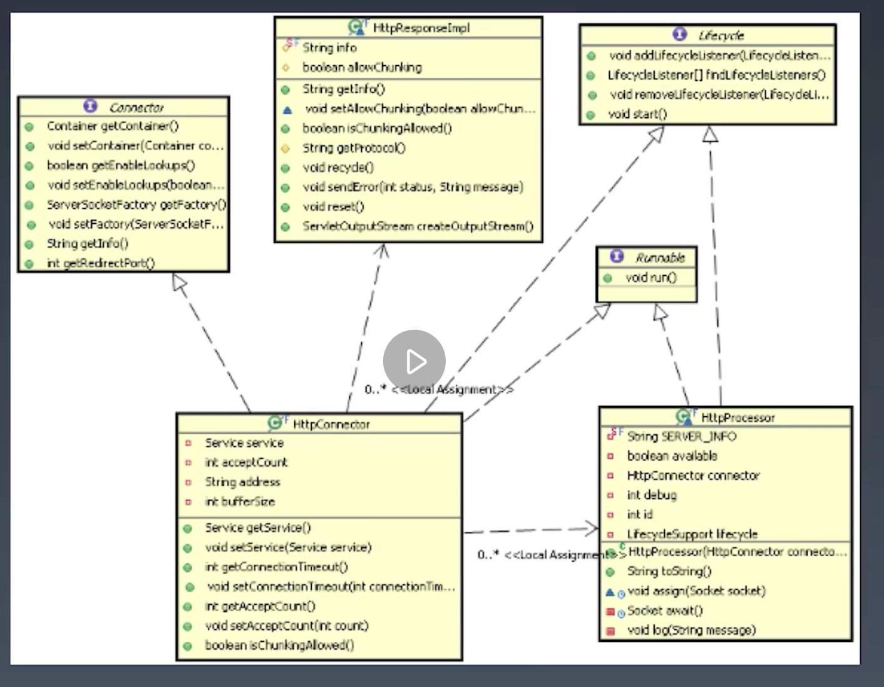
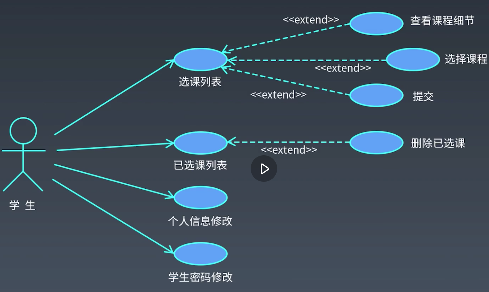

# 架构设计图

## 4+1 架构视图模型

软件架构 = 元素, 形式, 关系/约束

### 逻辑视图:

* 相关方: 客户, 用户, 开发组织管理者
* 视角: 系统的功能元素, 结构职责, 交互
* 主要元素: 系统, 子系统, 功能模块, 子功能模块, 接口
* 用途: 开发组织划分, 成本/进度的评估

逻辑视图: 功能模块图

### 过程视图:

* 相关者: 性能优化, 开发相关人员
* 视角: 系统运行时线程, 进程的情况
* 主要元素: 系统进程, 线程以及处理队列等

过程视图

### 物理视图:

* 相关者: 系统集成商, 系统运维人员
* 视角: 系统逻辑组件到物理节点的物理部署和节点之间的物理网络配置
* 主要元素: 物理节点以及节点的通信

物理视图: 

### 开发视图:

* 相关者: 开发相关人员, 测试人员
* 视角: 系统如何开发实现
* 主要元素: 描述系统的层, 分区, 包, 框架, 系统通用服务, 业务通用服务, 类和接口, 系统平台和相关的基础框架
* 用途: 指导开发组织设计和开发实现

开发视图: 类图

### 场景视图 :

* 相关者: 用户, 设计和开发人员
* 视角: 概括了架构上最重要的场景 (最典型或者最有分享) 以其非功能性需求, 通过这些场景的实现, 阐明了架构的广度或众多架构元素运行的方式 

场景视图: 用例图

## 使用 UML 进行架构设计

模型: 领悟问题到计算机系统的映射

领域问题 -> 领域模型 / 设计模型 -> 解决方案

